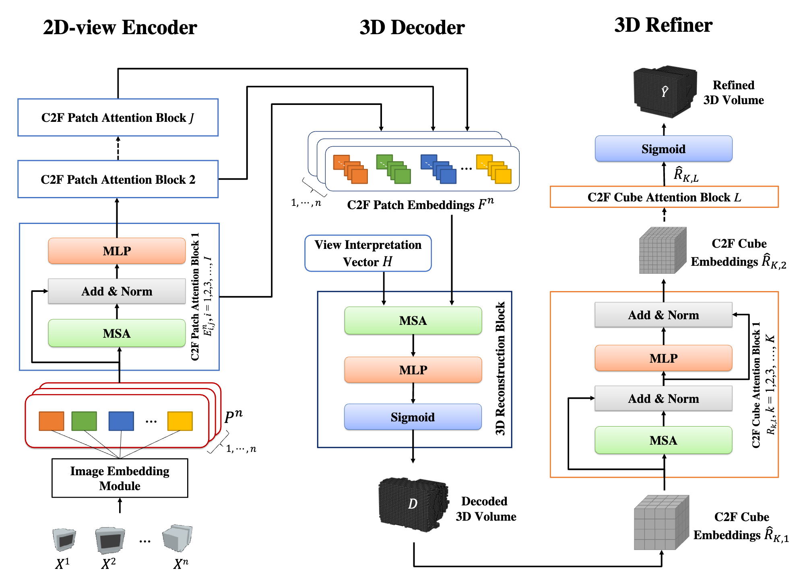

# 3D-C2FT: Coarse-to-fine Transformer for Multi-view 3D Reconstruction

### Introduction
This repository contains the source code for the paper [3D-C2FT: Coarse-to-fine Transformer for Multi-view 3D Reconstruction](https://arxiv.org/abs/2205.14575), which is accepted by ACCV 2022.
<p align="center">
  
</p>


### Dataset
We use the ShapeNet and Multi-view Real-life datasets, which are available as follows:
- [ShapeNet](https://shapenet.org/)
- [Multi-view Real-life](https://github.com/tiongleslie/3D-C2FT/tree/main/dataset)


### Compatibility
We tested the codes with:
  1) PyTorch with and without GPU under Ubuntu 18.04 and Anaconda3 (Python 3.7)
  2) PyTorch with and without GPU under Windows 10 and Anaconda3 (Python 3.7 and 3.9)
  3) PyTorch with CPU under MacOS 12.0 (M1) and Anaconda3 (Python 3.7 and 3.9)


### Requirements
  1) [Anaconda3](https://www.anaconda.com/distribution/#download-section)
  2) [PyTorch](https://pytorch.org/get-started/locally/)
  3) [Matplotlib](https://anaconda.org/conda-forge/matplotlib)
  4) [Open3D](http://www.open3d.org/docs/release/getting_started.html)
  5) [PyMCubes](https://pypi.org/project/PyMCubes/)
  6) [Natsort](https://pypi.org/project/natsort/)
  

### Usage
- Run the code `eval.py` with the given configuration in config.py
```shell
$ python eval.py --dataset_mode "Ours"
```


### Pretrained Model
The pretrained model is available at here:
- [3D-C2FT](https://drive.google.com/file/d/1shLa0ikbiV6Ue59k5Pib66PjzOkx6Gfz/view?usp=sharing)


### License
This work is an open-source under MIT license.


### Cite this work
```
@misc{Tiong2022,
      title={3D-C2FT: Coarse-to-fine Transformer for Multi-view 3D Reconstruction}, 
      author={Leslie Ching Ow Tiong and Dick Sigmund and Andrew Beng Jin Teoh},
      year={2022},
      eprint={2205.14575},
      archivePrefix={arXiv}
}
```
